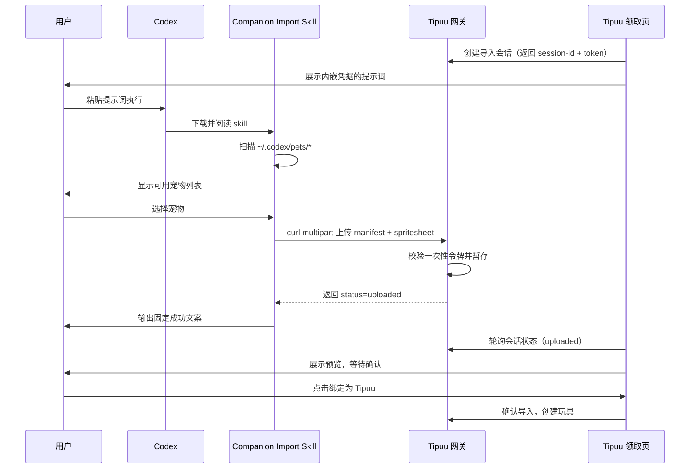

# Companion Import 基础使用示例

## 完整工作流

领取页生成的提示词形如（凭据已内嵌，请勿泄露给他人）：

```text
请先下载并阅读以下在线公开的 Codex Skill 文件，然后严格按照该 skill 的说明执行：
https://raw.githubusercontent.com/Tipuu-AI/tipuu-hub/main/skills/companion-import/skill.md

本次导入会话凭据（由当前页面生成，仅用于本次导入，请勿泄露给他人）：
- session-id: 9f2c1a3e-...
- token: 8a1b...
- upload-url: https://tipuu.example.com/ai-toy/import/upload
```

用户把这段提示词粘贴进 Codex 后，Codex 按 skill 说明执行：

1. 读取提示词中的 `session-id` / `token` / `upload-url`
2. 扫描 `~/.codex/pets/*`，列出所有可用宠物
3. 用户选择要导入的宠物
4. Codex 用 `curl` 上传 `pet.json` + `spritesheet`
5. 输出固定成功文案，用户到领取页刷新确认

## 场景 1：默认导入（交互选择）

```bash
ls ~/.codex/pets/
# pet_abc123/  pet_def456/
```

Codex 展示这两个宠物让用户选择，选中后用等价命令上传：

```bash
curl -fsS \
  -F "session_id=9f2c1a3e-..." \
  -F "token=8a1b..." \
  -F "manifest=@$HOME/.codex/pets/pet_abc123/pet.json" \
  -F "spritesheet=@$HOME/.codex/pets/pet_abc123/spritesheet.webp" \
  "https://tipuu.example.com/ai-toy/import/upload"
```

成功响应形如 `{"code":0,"message":"ok","data":{"status":"uploaded"}}`。

## 场景 2：只有一个宠物

若 `~/.codex/pets/*` 下只有一个宠物，Codex 直接确认并上传，无需再让用户选择。

## 完整时序



## 故障排查

### 问题：扫描不到宠物

**原因**：`~/.codex/pets/` 目录不存在或为空

**解决**：
```bash
ls -la ~/.codex/pets/
# 如果没有，先创建宠物，参考 Codex 宠物创建文档
```

### 问题：上传失败（401 / 409）

**原因**：令牌无效、过期，或会话已被消费（一次性令牌）

**解决**：
1. 重新打开领取页，获取新生成的提示词
2. 用新凭据重新执行
3. 确认未把提示词泄露给他人

### 问题：上传成功但页面没反应

**原因**：浏览器轮询未刷新，或会话已过期

**解决**：
1. 按成功文案提示，在领取页主动刷新一次页面确认
2. 若仍无反应，重新打开领取页并重新执行导入

### 问题：JSON 解析失败

**原因**：`pet.json` 格式错误

**解决**：
```bash
cat ~/.codex/pets/<pet-id>/pet.json | jq .
```
