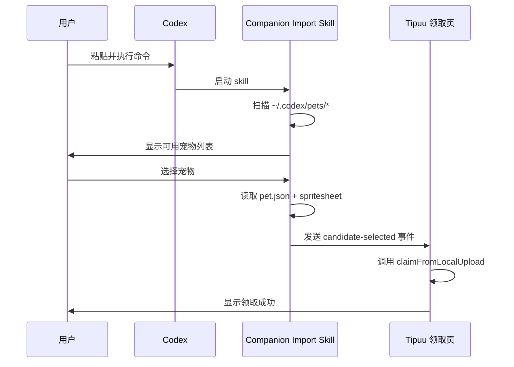

# Companion Import 基础使用示例

## 场景 1：默认导入

最简单的使用方式，使用默认通道：

```bash
tipuu-companion-import --callback-url "https://tipuu.example.com/local-import.html?source=claim"
```

**流程**：
1. 执行命令后，skill 自动扫描 `~/.codex/pets/*`
2. 列出所有可用宠物
3. 用户选择要导入的宠物
4. 自动回传 `pet.json` 和 `spritesheet` 到领取页

## 场景 2：指定宠物 ID

如果已知宠物 ID，可以直接指定：

```bash
tipuu-companion-import \
  --callback-url "https://tipuu.example.com/local-import.html?source=claim" \
  --pet-id "pet_abc123"
```

**流程**：
1. 直接定位到指定宠物
2. 跳过选择步骤
3. 立即回传文件

## 场景 3：自定义通道

使用自定义消息通道（高级用法）：

```bash
tipuu-companion-import \
  --callback-url "https://tipuu.example.com/local-import.html?source=claim" \
  --channel "my-custom-channel"
```

**注意**：领取页需要监听相同的通道才能接收消息。

## 完整工作流



## 故障排查

### 问题：扫描不到宠物

**原因**：`~/.codex/pets/` 目录不存在或为空

**解决**：
```bash
# 检查目录是否存在
ls -la ~/.codex/pets/

# 如果没有，先创建宠物
# 参考 Codex 宠物创建文档
```

### 问题：回传失败

**原因**：回调地址不正确或通道未监听

**解决**：
1. 确认 `--callback-url` 包含 `source=claim`
2. 确认领取页已打开并监听指定通道
3. 检查浏览器控制台是否有错误信息

### 问题：JSON 解析失败

**原因**：`pet.json` 格式错误

**解决**：
```bash
# 验证 JSON 格式
cat ~/.codex/pets/<pet-id>/pet.json | jq .
```
