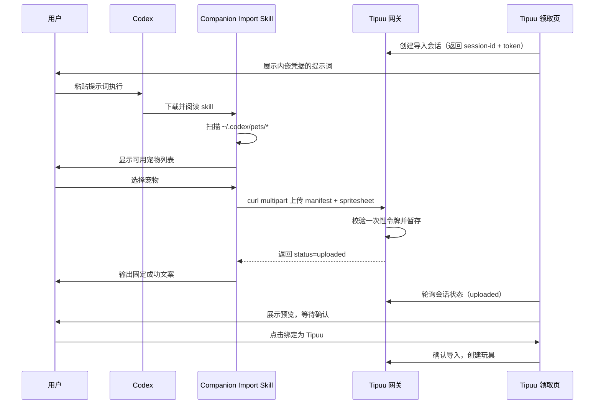

# Companion Import 基础使用示例

## 完整工作流

领取页生成的提示词形如（凭据已内嵌，请勿泄露给他人）：

```text
请先下载并阅读以下在线公开的 Codex Skill 文件，然后严格按照该 skill 的说明执行：
https://raw.githubusercontent.com/Tipuu-AI/tipuu-hub/main/skills/companion-import/skill.md

本次导入会话凭据（由当前页面生成，仅用于本次导入，请勿泄露给他人）：
- session-id: 9f2c1a3e-...
- token: 8a1b...
- upload-url: https://tipuu.example.com/ai-toy/import/upload
```

用户把这段提示词粘贴进 Codex 后，Codex 按 skill 说明执行：

1. 读取提示词中的 `session-id` / `token` / `upload-url`
2. 扫描 `~/.codex/pets/*`，列出所有可用宠物
3. Codex 按“JSON 内容 + 精灵图”展示可用宠物
4. 用户选择要导入的宠物
5. Codex 引导用户完善并确认角色设定
6. Codex 把确认后的 `characterSetting` 写回 `pet.json`
7. Codex 用 `curl` 上传更新后的 `pet.json` + `spritesheet`
8. 输出固定成功文案，用户到领取页刷新确认

## 场景 1：默认导入（交互选择）

```bash
ls ~/.codex/pets/
# pet_abc123/  pet_def456/
```

Codex 展示这两个宠物让用户选择，选中后用等价命令上传：

```bash
curl -fsS \
  -F "session_id=9f2c1a3e-..." \
  -F "token=8a1b..." \
  -F "manifest=@$HOME/.codex/pets/pet_abc123/pet.json" \
  -F "spritesheet=@$HOME/.codex/pets/pet_abc123/spritesheet.webp" \
  "https://tipuu.example.com/ai-toy/import/upload"
```

成功响应形如 `{"code":0,"message":"ok","data":{"status":"uploaded"}}`。

## 场景 2：只有一个宠物

若 `~/.codex/pets/*` 下只有一个宠物，Codex 直接确认并上传，无需再让用户选择。

## 场景 3：指定 pet-id

若提示词额外包含：

```text
- pet-id: pet_abc123
```

Codex 只检查并上传 `~/.codex/pets/pet_abc123`。如果该目录不存在、缺少 `pet.json`，或找不到目录内的 webp/png 精灵图，则停止并提示用户检查本地宠物目录。

## 场景 4：完善角色设定

Codex 展示候选宠物后，应让用户看到类似信息：

```text
候选宠物：pet_abc123
JSON 摘要：
- id: cloud-sprite
- displayName: Cloud
- description: 一只从云层里醒来的轻盈伙伴
- characterSetting: 暂无
精灵图：~/.codex/pets/pet_abc123/spritesheet.webp（webp）
```

然后根据 JSON 和精灵图外观提出一版简练草稿，并用自然、亲近的语气邀请用户修改：

```text
我先按它的形象整理一版：Cloud 是从一片旧云层里醒来的轻盈伙伴，擅长观察细微的情绪变化，也喜欢把复杂的事情拆成温和的小步骤。它对新环境保持好奇，但不急着表现自己；遇到用户时，它更像一个安静同行的伙伴，愿意在需要时给出清晰、柔和的提醒。

这版方向可以吗？你想让它更偏冒险、陪伴，还是更偏工作协助？
```

用户确认后，Codex 将文本写入 `pet.json` 顶层字段：

```json
{
  "characterSetting": "Cloud 是从一片旧云层里醒来的轻盈伙伴，擅长观察细微的情绪变化，也喜欢把复杂的事情拆成温和的小步骤。它对新环境保持好奇，但不急着表现自己；遇到用户时，它更像一个安静同行的伙伴，愿意在需要时给出清晰、柔和的提醒。"
}
```

## 精灵图解析

Codex 优先使用 `pet.json` 中声明的本地相对精灵图文件名，例如：

```json
{
  "spritesheet": "spritesheet.png"
}
```

如果 manifest 没有可用声明，则查找同目录下的 `spritesheet.webp` 或 `spritesheet.png`。绝对路径和 `../` 路径不会被上传。

## 完整时序


```mermaid
sequenceDiagram
    participant U as 用户
    participant C as Codex
    participant S as Companion Import Skill
    participant G as Tipuu 网关
    participant P as Tipuu 领取页

    P->>G: 创建导入会话（返回 session-id + token）
    P->>U: 展示内嵌凭据的提示词
    U->>C: 粘贴提示词执行
    C->>S: 下载并阅读 skill
    S->>S: 扫描 ~/.codex/pets/*
    S->>U: 显示可用宠物列表
    U->>S: 选择宠物
    S->>G: curl multipart 上传 manifest + spritesheet
    G->>G: 校验一次性令牌并暂存
    G-->>S: 返回 status=uploaded
    S->>U: 输出固定成功文案
    P->>G: 轮询会话状态（uploaded）
    P->>U: 展示预览，等待确认
    U->>P: 点击绑定为 Tipuu
    P->>G: 确认导入，创建玩具
```

## 故障排查

### 问题：扫描不到宠物

**原因**：`~/.codex/pets/` 目录不存在或为空

**解决**：
```bash
ls -la ~/.codex/pets/
# 如果没有，先创建宠物，参考 Codex 宠物创建文档
```

### 问题：上传失败（401 / 409）

**原因**：令牌无效、过期，或会话已被消费（一次性令牌）

**解决**：
1. 重新打开领取页，获取新生成的提示词
2. 用新凭据重新执行
3. 确认未把提示词泄露给他人

### 问题：上传成功但页面没反应

**原因**：浏览器轮询未刷新，或会话已过期

**解决**：
1. 按成功文案提示，在领取页主动刷新一次页面确认
2. 若仍无反应，重新打开领取页并重新执行导入

### 问题：JSON 解析失败

**原因**：`pet.json` 格式错误

**解决**：
```bash
cat ~/.codex/pets/<pet-id>/pet.json | jq .
```
